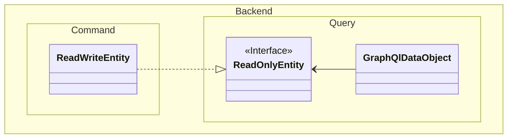

# JLib.Cqrs Documentation

adds interfaces, types and automated mapping profiles for CQRS Architectures


# GraphQl CQRS DDD Project Template Description
This Project Setup Suggestion describes a way to structure a DDD CQRS Project, using the JLib as a framework.

> Do note, that this template has only been used on smaller, single domain projects as of now and may therefore be incomplete or not fully tested for larger projects.

> also note, that the location of each project is dictated by design principles only and could always be changed to fit your needs.

## Minimized Project Setup
we use 
- EfCore and a SQL Database to access data
- a single domain

### Project Setup
#### Create an empty solution with 3 Projects:
- Backend.Starter
    - will be referred to as `Starter`
    - the executable program of your choosing
- Backend.StarterBase
    - will be referred to as `StarterBase`
- Backend.StarterBase.Tests
- Backend.[[DomainName.]]Command
    - will be referred to as `Command`
- Backend.[[DomainName.]]Command.Tests
- Backend.[[DomainName.]]Query
    - will be referred to as `Query`
- Backend.[[DomainName.]]Command.Tests

#### Delete the follwoing files:
- `Starter`/WeatherForecast.cs
- `Starter`/Controllers
- `Command`/Class1.cs
- `Query`/Class1.cs
#### Delete or Clean the following files:
- Starter.WebApi.http

### Project References
- `Starter`
    - references `Command `and `Query`

### Directory.Build.Props
create a `Directory.Build.Props` file in the root of your solution with the following content:
> The location of the file is critical to it's function. it should not be contained in any sub-directory

This file 
- replaces the "backend" section of the project name with the name of your project
- automamtically adds the correct testing references to the test projects
- converts nullabillity warnings to errors

> The package versions should be updated after creating the file
> They have to be set manually inside the file
> The file may be relaced by a better suitable mechanism such as [Directory.Packages.props](https://learn.microsoft.com/en-us/nuget/consume-packages/Central-Package-Management)

>!Todo: update file content
```xml
<!--
    Replace {{ProjectName}} with the name of your project, without a leading "."
-->
<Project>
    <PropertyGroup>
        <TargetFramework>net8.0</TargetFramework>
        <Nullable>enable</Nullable>
        <WarningsAsErrors>Nullable</WarningsAsErrors>
        <Company></Company>
        <Authors></Authors>
        <Version>0.0.0</Version>
        <ImplicitUsings>enable</ImplicitUsings>
        <AssemblyName>$(MSBuildProjectName.Replace("Backend.","{{ProjectName}}."))</AssemblyName>
        <RootNamespace>$(MSBuildProjectName.Replace(" ", "_").Replace("Backend.","{{ProjectName}}."))</RootNamespace>
        <IsTestProject>$(MSBuildProjectName.EndsWith('Tests'))</IsTestProject>
    </PropertyGroup>


    <ItemGroup Condition="$(MSBuildProjectName.EndsWith('.Command'))">
        <ProjectReference Include="..\$(MSBuildProjectName.Replace('.Command', '.Query'))\$(MSBuildProjectName.Replace('.Command', '.Query')).csproj" />
    </ItemGroup>
    <ItemGroup Condition="$(MSBuildProjectName.EndsWith('.Query'))">
        <InternalsVisibleTo Include="$(AssemblyName.Replace('.Query', '.Command'))"/>
    </ItemGroup>

    <ItemGroup Condition="!$(AssemblyName.EndsWith('.Tests'))">
        <InternalsVisibleTo Include="$(AssemblyName).Tests"/>
    </ItemGroup>

    <!-- Debug Assemblies-->
    <ItemGroup Condition="'$(Configuration)' == 'Debug' or $(MSBuildProjectName.EndsWith('Testing')) or $(MSBuildProjectName.EndsWith('Testng'))">
        <PackageReference Include="JLib.DataGeneration" Version="0.11.1" />
        <Using Include="JLib.DataGeneration"/>
    </ItemGroup>

    <!--Test Projects-->
    <PropertyGroup Condition="$(IsTestProject)==true or $(MSBuildProjectName.EndsWith('Testing'))">
        <IsPackable Condition="$(OutputType)==Library">false</IsPackable>
    </PropertyGroup>

    <ItemGroup Condition="$(IsTestProject)==true or $(MSBuildProjectName.EndsWith('Testing'))">
        <!--Setup-->
        <PackageReference Include="Microsoft.NET.Test.Sdk" Version="17.13.0" />
        <PackageReference Include="xunit" Version="2.9.3" />
        <PackageReference Include="xunit.abstractions" Version="2.0.3" />
        <PackageReference Include="xunit.assert" Version="2.9.3" />
        <PackageReference Include="xunit.runner.visualstudio" Version="3.0.2">
            <IncludeAssets>runtime; build; native; contentfiles; analyzers; buildtransitive</IncludeAssets>
            <PrivateAssets>all</PrivateAssets>
        </PackageReference>
        <PackageReference Include="coverlet.collector" Version="6.0.4">
            <IncludeAssets>runtime; build; native; contentfiles; analyzers; buildtransitive</IncludeAssets>
            <PrivateAssets>all</PrivateAssets>
        </PackageReference>
        <!--test methods-->
        <PackageReference Include="Snapshooter.Xunit" Version="1.0.1" />
        <PackageReference Include="FluentAssertions" Version="7.2.0" />
        <PackageReference Include="Moq" Version="4.*" />
        <!--logging-->
        <PackageReference Include="Microsoft.Extensions.Logging" Version="9.0.2" />
        <PackageReference Include="Microsoft.Extensions.Logging.Abstractions" Version="9.0.2" />
        <PackageReference Include="Xunit.Extensions.Logging" Version="1.*" />
        <!--dependency injection-->
        <PackageReference Include="Microsoft.Extensions.DependencyInjection.Abstractions" Version="9.0.2" />

        <!--used packages-->
        <PackageReference Include="Microsoft.Extensions.Configuration" Version="9.0.2" />
        <PackageReference Include="Microsoft.Extensions.Configuration.Json" Version="9.0.2" />
        <PackageReference Include="Serilog.Extensions.Logging" Version="9.0.0" />
        <PackageReference Include="Serilog.Sinks.XUnit" Version="3.0.19" />
    </ItemGroup>
</Project>
```


### Creating the Entities
#### Create the Directories
- `Command`/ReadWriteEntities
- `Query`/ReadOnlyEntities
- `Query`/GraphQlDataObjects
    - Your GraphQl DataObjects should implement IMappedGraphQlDataObject&lt;IFileRoe>



## Project Setup - Including architecture notes
The Initial Setup requires at least 3 projects:
- **Starter**
    - any launchabe project template of a compatible .net version
    - launches the application and contains the setup logic
    - multiple starter projects may be used, when the application is split into multiple servers or is required to run on different cloud resources. The Core Project may be usefull in such cases    
- **Domain.Command** 
    - C# Class Library
    - everything which can write data for a secific domain
    - types, which should be inaccessible to other domains, should be declared as internal
- **Domain.Query** 
    - C# Class Library
    - everything which can read data for a specific domain
    - types, which should be inaccessible to other domains, should be declared as internal

But may also include the following:
- **Domain.Shared**
    - May be used if
        - You use a multi domain architecture
    - everything which may be accessed by another domain
    - it may be split up into Domain.Shared.Query and Domain.Shared.Command
    - may not be needed, since internal types of the command and query projects can be declared as internal, and shared ones as public.
        - doing so may be better, since using the shared assembly gives the query project of a foreign assembly access to mutations, stored in this Shared project.
    - has not been used in practice yet, but may be useful when using multiple domains
- **Core**
    - May be used If
        - You use a multi domain Architecture
        - and have multiple Starter projects
    - contains the shared logic for all domains

> The EfCore Database Migration tool may not be able to work with the default starter project.
> You may have to create a new console project, which references the command and query projects, to be able to run the migration commands.

## Creating the Entities
# CQRS Project Template Documentation

## Q & A
- why should the command and query projects be separated?
    - this is a common pattern in CQRS architectures, which allows for better separation of concerns and easier scaling of the application. 
    - it also allows for different teams to work on different parts of the application without stepping on each others toes.
    - not doing so may result in a developer unknowingly using command types in the query section, which will make a later separation way harder.
    - 